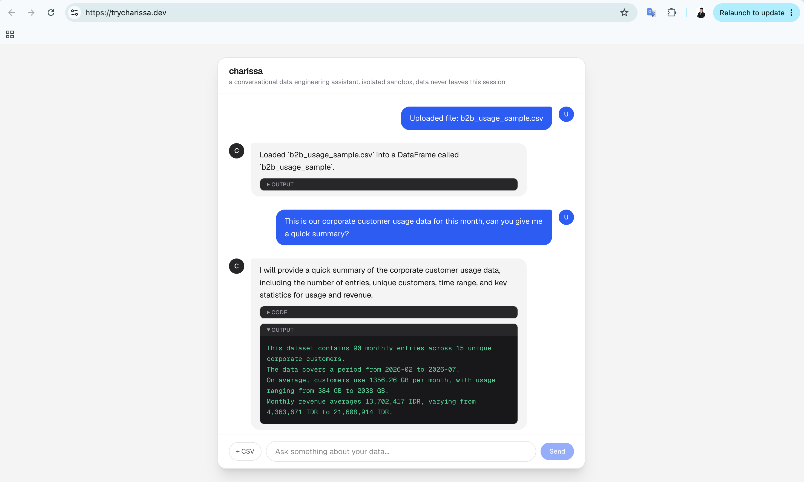
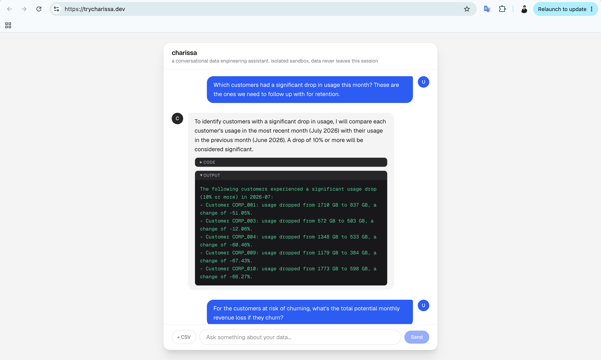
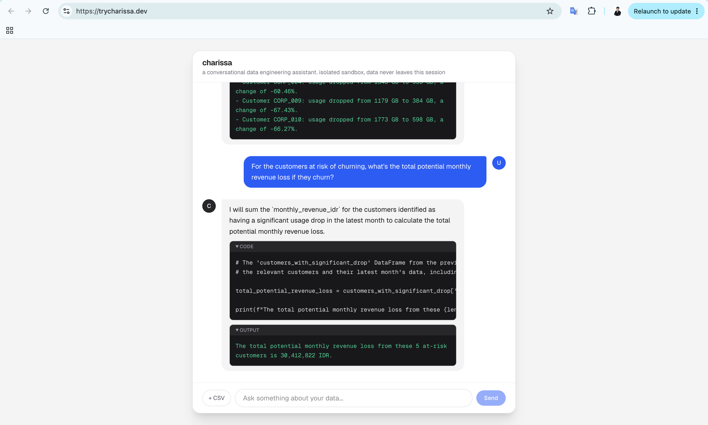

# charissa

A conversational data engineering assistant. Chat with your data, run generated code against real data sources (files, SQL), and get results back without writing code by hand. Live at [trycharissa.dev](https://trycharissa.dev).

While working as a Data Scientist Apprentice (B2B Operations and Analytics) at PT. Indosat Tbk, I kept running into the same wall: AI could genuinely help with the data in front of me, but that data was confidential, so tools like ChatGPT were never an option. Charissa is my answer to that problem: an LLM-backed data platform built so an AI can write and run code against your data, with the raw dataset staying inside infrastructure you control and only the results the code prints ever reaching the model.

## Who this is for

Charissa isn't built for the general public. **It's built for organizations
that want AI-assisted data analysis but can't send their data to a
third-party service.** Financial, healthcare, and government teams need that help but are
bound by compliance requirements that rule out tools like ChatGPT for anything
touching sensitive data. Charissa's architecture (self-hosted, a network-isolated
sandbox, and connectors straight into a private database) exists specifically
to answer that constraint: the raw dataset never leaves infrastructure you
control, and the sandbox's disabled networking means code can't exfiltrate it
over the internet. What does reach the LLM is only what the code prints
(summaries, computed results), since that's how the model sees what happened
and can keep reasoning or answer in plain English.

## Example: B2B churn analysis

A walkthrough from the point of view of a B2B operations analyst: upload real
usage data, ask for a summary, flag accounts at risk, then quantify the
business impact. No step here required writing a line of Python by hand.

**1. Upload a CSV and ask for a quick summary**



**2. Identify accounts with a significant usage drop**



**3. Quantify the revenue at risk, code included**



## Status

Deployed end-to-end: Next.js frontend on Vercel, FastAPI backend on a self-managed VPS, sandboxed code execution, multi-source data connectors, and an audit trail.

| Component | URL |
|---|---|
| Frontend (Vercel) | [trycharissa.dev](https://trycharissa.dev) |
| Backend (VPS, HTTPS via Caddy) | [api.trycharissa.dev](https://api.trycharissa.dev) |

## Architecture

```
Browser
  │  HTTPS
  ▼
Next.js frontend (Vercel)
  │  HTTPS
  ▼
Caddy (auto TLS) → FastAPI backend (VPS)
  │                       │
  ▼                       ▼
Gemini API          Docker sandbox (network-isolated, one per session)
                          │
                          ▼
                    Postgres / CSV data sources
```

- **LLM layer**: provider-agnostic interface (`charissa/llm`), currently backed by Gemini.
- **Execution**: each chat session gets its own Docker container with networking fully disabled, so generated code can read the data it's given but can't reach the internet. The raw dataset stays inside that container; only what the code prints (e.g. a summary or a computed result) is sent back to the LLM, since that's how it sees what happened and can keep reasoning.
- **Data connectors**: CSV and Postgres. Credentials and queries stay on the trusted host; only the resulting rows are ever handed to the sandbox.
- **Session lifecycle**: idle sessions are swept and their containers torn down automatically, so the service doesn't accumulate resources under real usage.
- **Access control**: optional API key gate (`API_KEYS`), a no-op in local dev, enforceable in a real deployment.
- **Rate limiting**: fixed-window limiter per API key (or client IP as a fallback), protecting both the LLM budget and the sandbox from abuse.
- **Audit log**: every chat turn (message, generated code, output) is persisted to Postgres, independent of the ephemeral sandbox, so there's a durable trail of what ran against what data.
- **CI**: every push runs the backend test suite (including real Docker-based sandbox tests) and frontend type/lint checks via GitHub Actions.

## Setup

1. Copy `backend/.env.example` to `backend/.env` and fill in `GEMINI_API_KEY`.
2. `cd backend && python3 -m venv .venv && .venv/bin/pip install -e ".[dev]"`
3. Run tests: `.venv/bin/pytest -v`
4. Run the API: `.venv/bin/uvicorn charissa.api.app:app --reload`
5. In another terminal: `cd frontend && cp .env.example .env.local && npm install && npm run dev`, then open http://localhost:3000

## API

- `GET /health` - liveness check, no auth required
- `POST /sessions` - start a new chat session (spins up an isolated sandbox)
- `POST /sessions/{id}/chat` - send a message, get back the agent's reply, code, and execution result
- `POST /sessions/{id}/upload` - upload a CSV, loaded into a pandas DataFrame the agent can reference in later turns
- `DELETE /sessions/{id}` - close a session and tear down its sandbox

All session endpoints require an `X-API-Key` header if `API_KEYS` is set in the
environment, and are rate-limited per key (`RATE_LIMIT_MAX_REQUESTS` per
`RATE_LIMIT_WINDOW_SECONDS`).

## Known gotchas

Some office/campus wifi blocks outbound ports 5432 (Postgres) and 22 (SSH), so
`DATABASE_URL` connections or SSH access can hang or time out on those networks
even though the code/server is fine. If something hangs, try a mobile hotspot
to confirm it's a network policy issue, not a bug. This doesn't affect the
deployed environment itself, only debugging from a restrictive network.

## License

All rights reserved. See [LICENSE](LICENSE). This repository is public for
viewing as a portfolio piece, not licensed for reuse.
