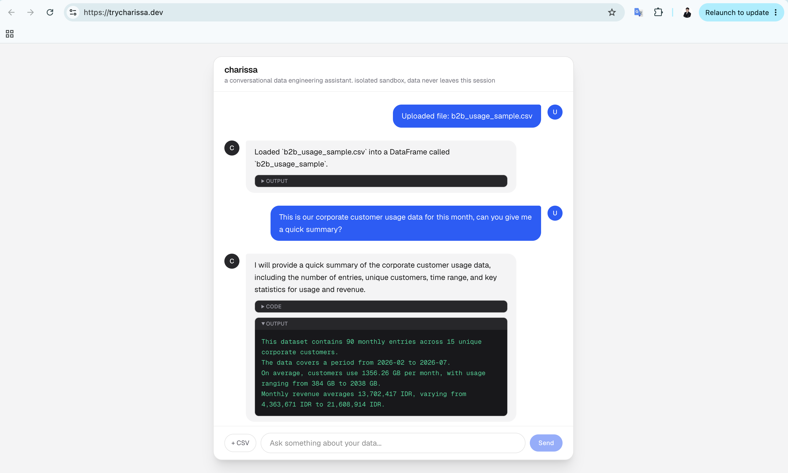
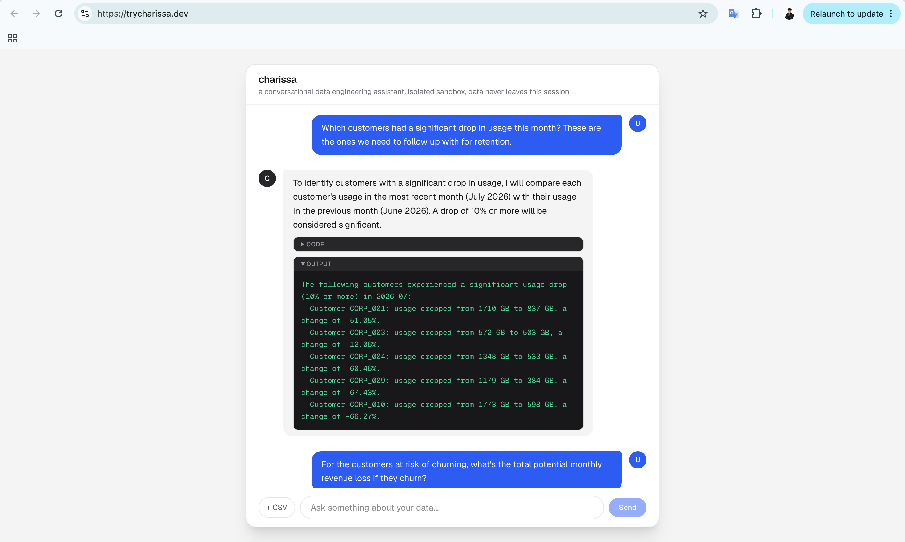
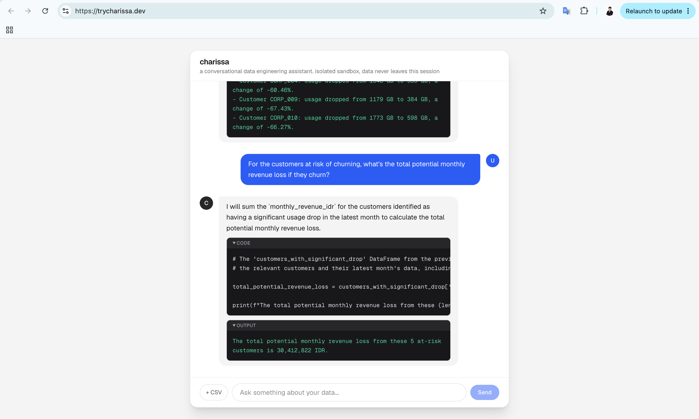
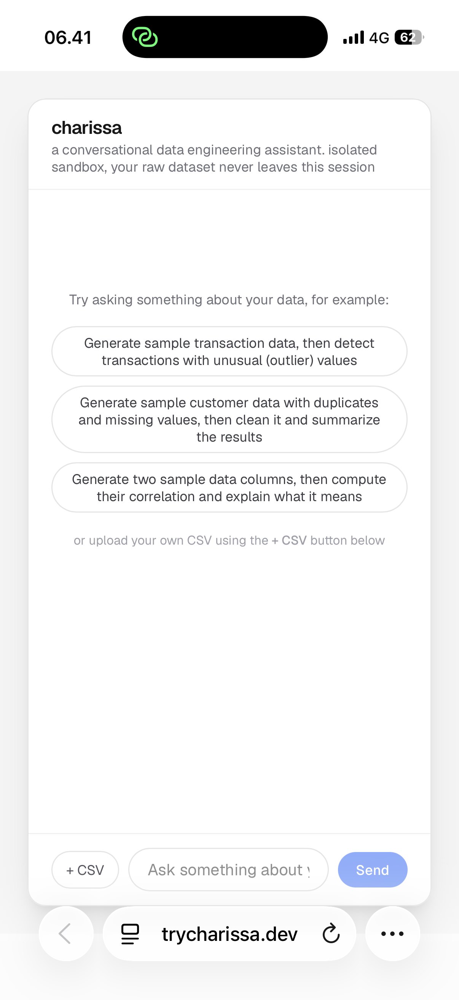

# charissa

Charissa is a friendly data assistant. Chat with it about your data. It writes and runs code for you. It works with files and databases. You get results without writing any code.

I built Charissa during an apprenticeship. I was a Data Scientist Apprentice at PT. Indosat Tbk, in B2B Operations and Analytics. I kept hitting the same problem there. AI could really help with my data. But that data was confidential. So tools like ChatGPT were not allowed. Charissa is my answer to that. It is an AI data platform you control. Your raw data stays on your own infrastructure. Only the results the code prints reach the AI model.

## Who this is for

Charissa is not built for everyone. **It is built for teams that want AI help with data, but cannot send that data to a third party.** Banks, hospitals, and government teams know this problem well. Compliance rules often block tools like ChatGPT for sensitive data. Charissa's design answers that problem directly. You host it yourself. Code runs inside an isolated sandbox. That sandbox cannot reach the internet. So your raw data can't leak out over the network. Only what the code prints reaches the AI. This might be a summary or a small result. That is how the AI still sees what happened, and can keep reasoning or reply in plain English.

## Example: B2B churn analysis

Here is a walkthrough from a B2B analyst's view. Upload real usage data. Ask for a quick summary. Flag accounts that might churn. Then measure the business impact. No step here needs manual Python code.

**1. Upload a CSV for a quick summary**



**2. Find accounts with a big usage drop**



**3. See the revenue at risk, with code included**



**Fully responsive on mobile**



## Status

I built and deployed this end to end. This happened during the apprenticeship above. The frontend runs on Vercel, built with Next.js. The backend ran on my own VPS, built with FastAPI. It had sandboxed code, several data connectors, and an audit trail. Everything worked live, as shown in the walkthrough above. The apprenticeship has now ended. So I shut down the backend VPS. This means live chat is no longer active.

| Component | URL |
|---|---|
| Frontend (Vercel) | [charissa-eta.vercel.app](https://charissa-eta.vercel.app) |
| Backend (VPS) | retired |

## Architecture

```
Browser
  │  HTTPS
  ▼
Next.js frontend (Vercel)
  │  HTTPS
  ▼
Caddy (auto TLS) → FastAPI backend (VPS)
  │                       │
  ▼                       ▼
Gemini API          Docker sandbox (network-isolated, one per session)
                          │
                          ▼
                    Postgres / CSV data sources
```

- **LLM layer**: works with any AI provider (`charissa/llm`). Right now it uses Gemini.
- **Execution**: each chat session gets its own Docker container. The container cannot reach the internet. It can only read the data you give it. The raw dataset stays inside that container. Only what the code prints (like a summary or a result) goes back to the LLM. That is how it sees what happened, and can keep reasoning.
- **Data connectors**: supports CSV files and Postgres. Credentials and queries stay on the trusted host. Only the result rows ever reach the sandbox.
- **Session lifecycle**: idle sessions get cleaned up automatically. Their containers get torn down too. This keeps resource use low under real usage.
- **Access control**: an optional API key gate (`API_KEYS`). It does nothing in local dev. It works fully in a real deployment.
- **Rate limiting**: a fixed-window limit per API key (or client IP as a backup). This protects both the LLM budget and the sandbox from abuse.
- **Audit log**: every chat turn (message, code, output) is saved to Postgres. This is kept separate from the short-lived sandbox. So there is always a clear trail of what ran, and against what data.
- **CI**: every push runs the backend test suite (including real Docker sandbox tests) and frontend type and lint checks, through GitHub Actions.

## Setup

1. Copy `backend/.env.example` to `backend/.env` and fill in `GEMINI_API_KEY`.
2. `cd backend && python3 -m venv .venv && .venv/bin/pip install -e ".[dev]"`
3. Run tests: `.venv/bin/pytest -v`
4. Run the API: `.venv/bin/uvicorn charissa.api.app:app --reload`
5. In another terminal: `cd frontend && cp .env.example .env.local && npm install && npm run dev`, then open http://localhost:3000

## API

- `GET /health` - checks if the server is alive. No login needed.
- `POST /sessions` - starts a new chat session. This also starts an isolated sandbox.
- `POST /sessions/{id}/chat` - sends a message. Returns the agent's reply, code, and result.
- `POST /sessions/{id}/upload` - uploads a CSV file. It loads into a dataframe the agent can use later.
- `DELETE /sessions/{id}` - closes a session. This also shuts down its sandbox.

Session endpoints may need an `X-API-Key` header. This only applies if `API_KEYS` is set in the environment. Each key is also rate-limited (`RATE_LIMIT_MAX_REQUESTS` per `RATE_LIMIT_WINDOW_SECONDS`).

## Known gotchas

Some office or campus wifi blocks certain ports. This includes port 5432 for Postgres and port 22 for SSH. So `DATABASE_URL` connections or SSH access can hang or time out on those networks, even though the code and server are fine. If something hangs, try a mobile hotspot instead. This helps confirm it's a network policy issue, not a bug. This doesn't affect the deployed environment itself, only debugging from a restrictive network.

## License

All rights reserved. See [LICENSE](LICENSE). This repository is public for viewing as a portfolio piece, not licensed for reuse.
